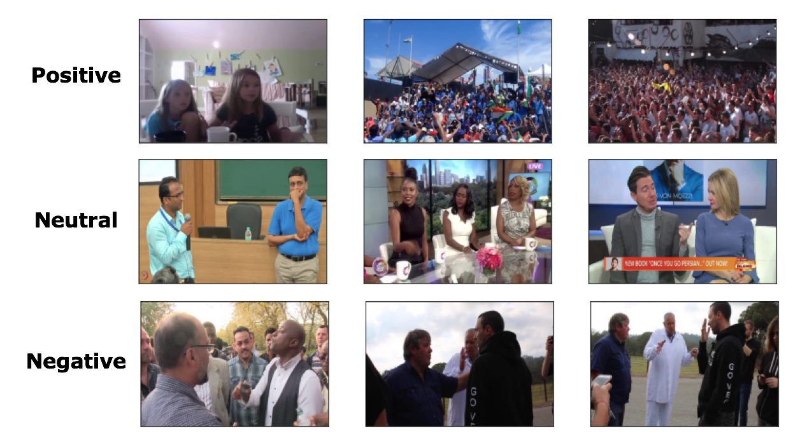
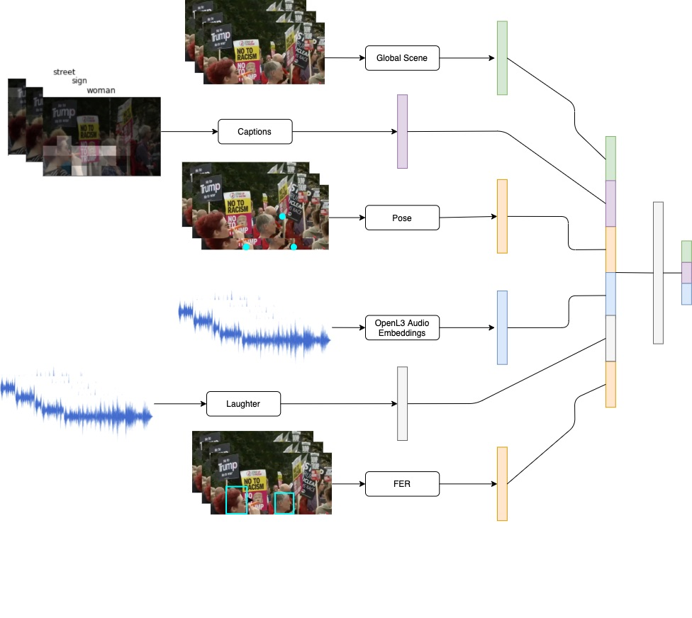
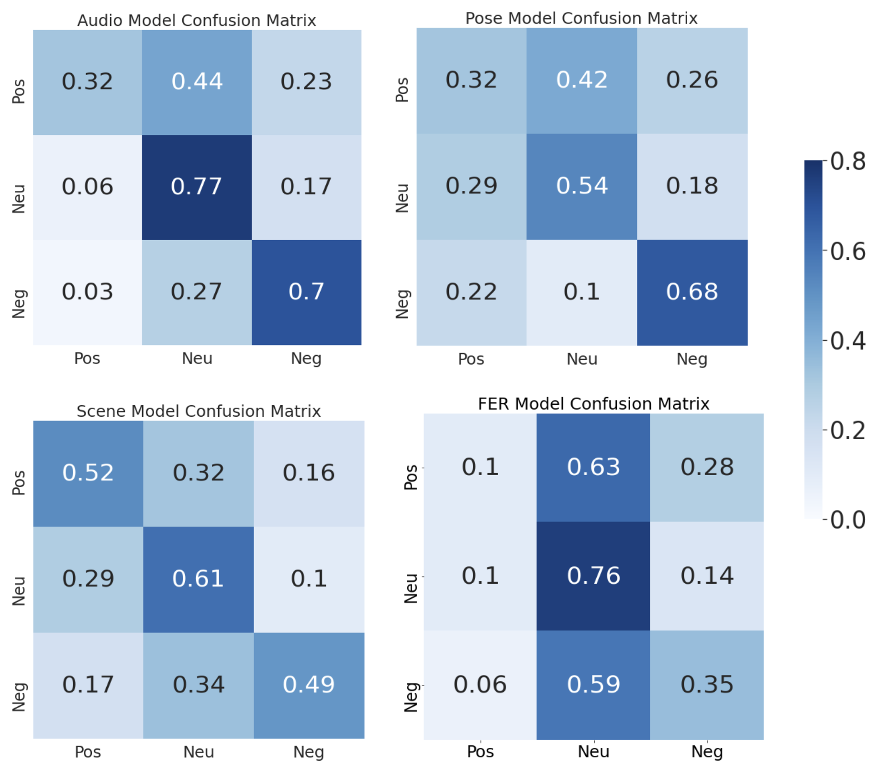

# CS231n - ***Fusical*** on EmotiW 2020

## Introduction
Despite cultural diversity, emotions are universal. We will undertake the EmotiW challenge, doing group-level sentiment recognition on videos from across the globe. Given short clips, the goal is to predict whether the video sentiment is positive, neutral, or negative. This problem is interesting because audio-visual sentiment analysis has implications in psychology and mental health.

## Dataset
We worked with the EmotiW 2020 dataset.

<div style="vertical-align:middle">
</div>

### Architecture
We ensembled models from four modalities: overall scene, pose, audio, and facial.

<div style="text-align:center">
</div>

## Getting Started

To start, please check out our [paper](report.pdf), [presentation](https://drive.google.com/file/d/15s1jfWtt37JV1BQu1e2gvfaTqEdFsgOK/view?usp=sharing), and [slide deck](https://docs.google.com/presentation/d/1rHWnZwHUW6CVbl7qutWYIRriGZnI6RD6-AfmcoQ0yJc/edit).

### Code Layout
The code is organized as follows:
- src/ - preprocessing, generation, and classification code
- notebooks/ - notebooks for training and prediction

### Try it out
Run this [notebook](notebooks/FINAL-ensemble_fc_predictions.ipynb) to see how our model works on the dataset

### Model Emporium 
We provide many of the models we trained [here](model-emporium.md) 

## Results


### Confusion matrix 

<div style="text-align:center">
</div>

### Table

| Modality  | Accuracy | F1-Score
| ------------- | ------------- | ------------- |
| Scene  | 0.546  | 0.541 |
| Pose  | 0.486  | 0.489 |
|Audio|0.577|0.577|
| Face | 0.4 |0.348 |
| **FC Ensemble** | **0.636** | **0.626** |


## The Team
[Boyang Tom Jin](https://www.linkedin.com/in/tomjinvancouver/), [Leila Abdelrahman](http://leilaabdel.com/), [Cong Kevin Chen](https://www.linkedin.com/in/cong-kevin-chen-11544186/), [Amil Khanzada](https://www.linkedin.com/in/amilkhanzada)<br>
[CS231n - Stanford University](http://cs231n.stanford.edu/)

## Citing Our Work
```
@misc{2020fusical,
  author =       {Boyang Tom Jin and Leila Abdelrahman and Cong Kevin Chen and
                  Amil Khanzada},
  title =        {Fusical},
  howpublished = {\url{https://github.com/kevincong95/cs231n-emotiw}},
  year =         {2020}
}
```
